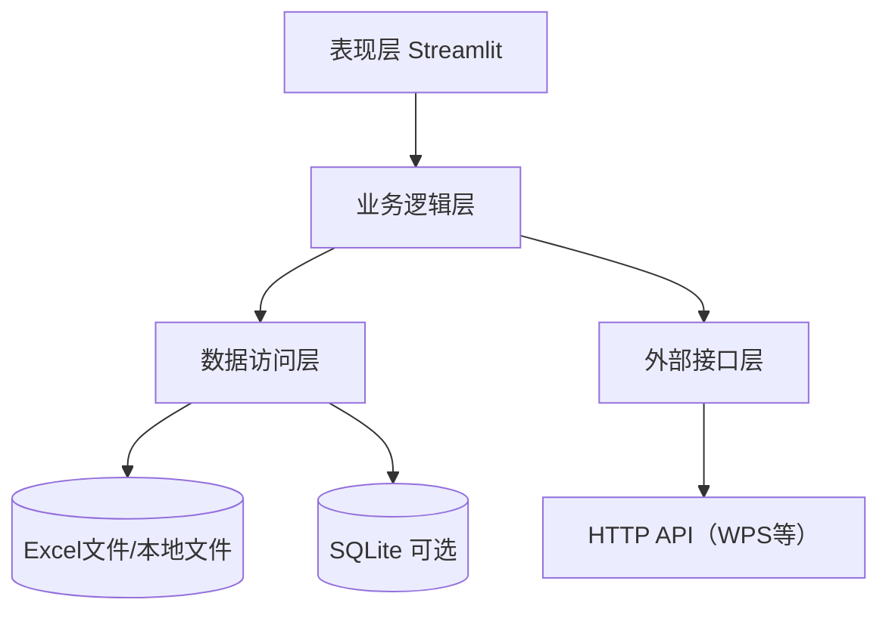
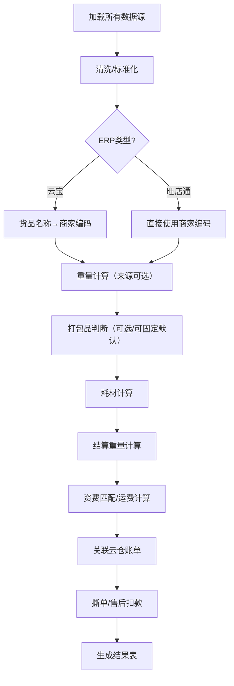

# 多云仓自动对账工具 - 技术架构设计文档

## 版本历史
| 版本 | 日期 | 修改说明 | 作者 |
|------|------|----------|------|
| V1.0 | 2025-03-04 | 初始架构设计 | 架构师 |
| V1.1 | 2025-03-04 | 补充报价表拆分设计、WPS接口集成 | 架构师 |
| V1.2 | 2026-03-06 | 同步当前Streamlit落地、资费表新结构（首重/续重+0段超重）、通用HTTP取数与多仓模块现状 | 架构师 |
| V1.3 | 2026-03-06 | 多仓模块口径收敛（仅命中检查/不做字段清洗与映射）、支持多选Sheet、分阶段懒解析与进度显示 | 架构师 |
| V1.4 | 2026-03-06 | 上传解析逻辑全模块统一：多选Sheet、分阶段懒解析与读取进度（主对账/回冲/分析/汇总账单） | 架构师 |
| V1.5 | 2026-03-07 | 主对账重量来源可切换、打包品匹配可选（含默认口径/忽略），预估重量列从表头选择 | 架构师 |

---

## 1. 引言

### 1.1 目的
本文档旨在描述多云仓自动对账工具的整体技术架构、模块划分、数据交互及核心算法逻辑，为开发团队提供统一的指导，确保系统实现的一致性、可维护性和可扩展性。

### 1.2 范围
涵盖系统所有功能模块：对账主流程、多仓快递费汇总回冲、快递费分析、云仓账单汇总（含资金流水与WPS集成）、资费转换和分析、预留模块（对账进度&资金&发票）。重点阐述各模块的内部逻辑、数据流、外部接口以及关键技术选型。

### 1.3 参考文档
- 《多云仓自动对账工具产品需求文档（PRD）V1.0》
- 《多云仓自动对账工具UI原型设计》

---

## 2. 总体架构

### 2.1 架构风格
系统采用**分层架构**，分为表现层（UI）、业务逻辑层、数据访问层和外部接口层。各层职责明确，降低耦合，便于测试和维护。

### 2.2 技术栈选择
| 层级 | 技术组件 | 说明 |
|------|----------|------|
| 表现层 | Streamlit（当前实现） | Web界面快速交付，适合对账/报表型交互；后续可替换为桌面端 |
| 业务逻辑层 | Python 3.9+ | 核心逻辑实现，包括数据处理、计算、分析 |
| 数据处理 | Pandas / NumPy | 高效处理表格数据，支持透视、分组、合并等操作 |
| 数据库 | SQLite（可选） | 当前以Excel/本地文件为主；如需断点续跑/配置中心可引入 |
| 外部接口 | requests / 通用HTTP取数 | 当前以通用HTTP配置取数（可对接WPS/其他平台）；专用WPS Client可后续固化 |
| 配置管理 | JSON / XML | 保存用户配置和字段映射模板 |
| 日志 | logging | 记录运行日志和错误信息 |
| 打包部署 | PyInstaller（可选） | 可打包为独立可执行文件（exe），降低非技术用户使用门槛 |

### 2.3 系统分层逻辑


- **表现层**：用户交互界面，接收输入，展示结果。
- **业务逻辑层**：实现所有功能模块的核心算法，调用数据访问层获取数据，调用外部接口层同步信息。
- **数据访问层**：封装对Excel文件和SQLite数据库的读写操作，提供统一的数据接口。
- **外部接口层**：封装对外部HTTP接口的调用（如WPS多维表/在线表格），处理认证、重试与取数解析。

---

## 3. 模块划分

系统按功能划分为6个主模块，每个模块包含若干子模块。公共模块（如配置管理、日志、数据导入）被各模块共享。

### 3.1 公共模块
| 模块名 | 职责 | 关键技术点 |
|--------|------|------------|
| ConfigManager | 管理用户配置（文件路径、字段映射、参数） | JSON读写，默认配置模板 |
| Logger | 记录系统运行日志和错误 | logging模块，日志轮转 |
| ExcelReader | 读取Excel文件，支持.xls/.xlsx | 引擎识别（xls→xlrd, xlsx→openpyxl）；支持仅读表头(nrows=0)、按列读取(usecols)以优化大表 |
| ExcelWriter | 写入Excel文件，支持多Sheet | pandas.ExcelWriter，分块写入 |
| FieldMapper | 字段映射管理（系统字段 ↔ 源表列名） | 主对账模块支持映射；多仓模块默认不做映射，仅做命中检查（要求源表列名已规范化） |
| HttpMetricClient | 在线取数（可选） | 通用HTTP配置（GET/POST、headers/body、value_path解析） |

### 3.2 对账主流程模块 (ModuleReconcile)
#### 3.2.1 子模块
- **DataLoader**：根据用户选择的ERP类型，加载旺店通/云宝发货明细、毛重表、重量段定义表、资费表、辅助表、云仓账单等，应用字段映射，返回DataFrame。

> 说明（导入一致性）：对账主流程各数据源的 Excel 上传统一支持“同一工作簿多选 Sheet”，并将选中 Sheet 合并读取（concat）；导入过程同样采用分阶段懒解析（Sheet名→表头→按需读取）并在读取阶段显示进度。
- **DataCleaner**：清洗收货省份/市，标准化日期，去重，处理空值。
- **NameToCodeMapper**（仅云宝）：根据云宝名称货品表，将货品名称替换为商家编码，标记未匹配项。
- **WeightCalculator**：计费重量原始的来源可配置：
    - 使用发货明细的预估重量列（kg）；或
    - 使用毛重表核算重量（数量×毛重(g)/1000）。
- **PackedJudge**：是否打包品判断可选：可根据箱规计算；也可由用户指定默认“打包品/非打包品/不限（忽略该条件）”。
- **ConsumableCalculator**：计算耗材费用（若启用）。
- **SettlementWeightCalculator**：根据实际重量和云仓重量段定义表，计算向上取整的结算重量；当超过最大段时保留原始重量，用于触发“0段超重规则”。
- **TariffMatcher**：核心报价匹配，根据多条件（云仓、快递公司、结算重量、省份、发货时间）匹配资费规则；“是否打包品”可作为可选条件参与匹配（未启用时忽略该条件）。
- **BillMatcher**：关联云仓账单，计算差异。
- **DeductionHandler**：关联撕单表和售后赔付表，扣减费用。
- **ResultGenerator**：生成对账结果表，输出DataFrame。

#### 3.2.2 报价表拆分设计
报价表拆分为两个独立表：
- **云仓重量段定义表**：字段（云仓、重量段结束），定义每个云仓的重量分段。
- **多条件资费表**：字段（云仓、快递公司、重量段结束、是否打包品、省份、生效开始日期、生效结束日期、首重、首费、续重、续费），支持通配符省份和打包品类型。

> 约定：当“重量段结束=0”时表示超重计费规则行（超过最大重量段时使用首重/续重递增公式计算）。

#### 3.2.3 内部逻辑流


### 3.3 多仓快递费汇总回冲模块 (ModuleMultiSummary)
#### 3.3.1 子模块
- **FileSelector**：管理多个对账结果文件的选择、行数统计、去重。
- **FieldPicker**：提供字段多选，记录用户选择的字段列表。
- **DataMerger**：合并多个文件的数据，支持分页预览。
- **SheetSplitter**：根据分Sheet规则（按云仓/省份/店铺/固定行数）拆分数据，生成多个DataFrame。
- **ExcelExporter**：将拆分后的数据写入Excel文件，命名Sheet。

#### 3.3.2 核心逻辑
1. 用户上传多个对账结果工作簿；每个工作簿可多选Sheet，选中的每个Sheet作为独立输入项。
2. 字段口径：
    - 工具不做同义词清洗/自动映射；要求用户在源表中手动将列名规范化为“标准字段名”。
    - 上传后仅进行“命中检查”（列名同名即命中），提示每个文件/Sheet 未命中的字段；未全部命中则禁止生成。
3. 性能策略（分阶段懒解析）：
    - 阶段A：仅解析工作簿Sheet名。
    - 阶段B：命中检查仅读取表头（nrows=0）获得列名。
    - 阶段C：点击生成后才读取明细数据，并使用 usecols 仅读取用户选择的字段列。
4. 合并与导出：
    - 合并所有输入项数据（concat）。
    - 若总行数超过阈值（可配置，当前实现默认80万），按云仓分Sheet并按阈值继续切片。
    - 导出阶段可显示读取/处理进度，避免用户误以为卡死。

### 3.4 快递费分析模块 (ModuleAnalysis)
#### 3.4.1 子模块
- **DataLoader**：加载单个云仓的对账结果表。

> 说明（导入一致性）：分析模块读取“对账结果表”时支持多选 Sheet；读取阶段显示进度，避免大表场景误以为卡死。
- **ConfigPanel**：提供运营交割价配置界面，存储为字典 {重量上限: 价格}。
- **ProvincePivot**：生成省份×重量档位的透视表，计算单量和占比。
- **TopSkuAnalyzer**：计算TOP单品排名及差价。
- **WeightPriceAnalyzer**：按结算重量分组统计平均单价、差价。
- **ReportExporter**：将分析结果导出为Excel，包含多个Sheet。

#### 3.4.2 核心算法
- **省份透视表**：使用pandas.pivot_table，index='省份', columns='结算重量(取整)', values='物流单号', aggfunc='count'，再计算占比。
- **TOP单品**：groupby('商家编码')，计算单量、快递费总额、平均单价，排序取前N，再根据运营交割价（取该单品最常见的重量区间对应价格）计算差价。
- **重量单价表**：groupby('结算重量(取整)')，计算单量、快递费汇总、平均单价，根据配置的运营交割价（可能需插值）计算差价。

### 3.5 云仓账单汇总模块 (ModuleBillSummary)
#### 3.5.1 子模块
- **DataLoader**：加载对账结果表；可选通过在线接口获取期初余额/本月预充等指标。

> 说明（导入一致性）：汇总账单模块读取“结果表”时支持多选 Sheet；读取阶段显示进度。
- **PeriodSelector**：用户选择年月和云仓。
- **BalanceCalculator**：计算期初应付（从历史记录或上月余额），汇总本月各项费用，计算期末余额。
- **BillGenerator**：生成汇总账单DataFrame（序号/项目/金额/余额），余额按行滚动。

> 说明：当前实现以“通用HTTP取数配置”方式对接在线数据源；专用WPS API Client（鉴权、表/视图/字段级配置、分页限流）可作为后续增强。

#### 3.5.2 外部接口：在线数据源取数（通用HTTP配置）
- **请求**：支持GET/POST、headers、JSON body。
- **解析**：通过 value_path 从JSON响应中提取数值。
- **错误处理**：超时/网络错误重试、并给出清晰错误信息。

#### 3.5.3 核心逻辑
```python
def generate_bill(reconcile_files, year_month, yuncang_list, wps_client, doc_id):
    # 1. 读取对账结果汇总
    # 2. 从WPS获取资金流水和开票进度
    # 3. 计算各云仓费用
    # 4. 构建账单DataFrame
    # 5. 可选上传至WPS
```

### 3.6 资费转换和分析模块 (ModuleTariff)
#### 3.6.1 子模块
- **Converter2DTo1D**：解析二维表（如矩阵形式），转换为标准一维表。需要用户指定行字段（省份）、列字段（重量区间）、值字段（价格），以及元数据（云仓、快递公司等）。
- **TariffQuery**：根据筛选条件（省份、结算重量、云仓、是否打包品、时效日期）从一维表中查询符合条件的规则。
- **QueryConditionParser**：解析用户输入的重量数值，匹配到对应的重量区间（如2.5kg匹配区间[2,3]）。

#### 3.6.2 核心算法
```python
def convert_2d_to_1d(df_2d, row_field, col_field, value_field, meta_fields):
    # 行转列
    df_melt = df_2d.set_index(row_field).stack().reset_index()
    df_melt.columns = [row_field, col_field, value_field]
    for k, v in meta_fields.items():
        df_melt[k] = v
    return df_melt

def query_tariff(tariff_df, province=None, weight=None, yuncang=None, is_packed=None, date=None):
    mask = True
    if province:
        mask &= (tariff_df['地区'] == province) | (tariff_df['地区'] == '*')
    if weight:
        mask &= (tariff_df['重量区间起始'] < weight) & (weight <= tariff_df['重量区间结束'])
    # 其他条件
    return tariff_df[mask]
```

### 3.7 预留模块 (ModuleProgress)
- 仅提供占位界面，后续可扩展为任务调度、资金流水管理、发票管理等功能。

---

## 4. 数据流设计

### 4.1 核心数据对象
| 对象 | 描述 | 存储形式 |
|------|------|----------|
| 对账结果表 | 包含所有订单的对账字段 | DataFrame / Excel（可选SQLite） |
| 资金流水表 | 云仓预充值、退款记录 | WPS在线文档 / Excel |
| 开票进度表 | 已开票、未开票信息 | WPS在线文档 / Excel |
| 重量段定义表 | 各云仓的重量分段 | DataFrame / SQLite表 |
| 资费表 | 多条件资费规则 | DataFrame / Excel（可选SQLite） |
| 毛重表 | 货品基础信息 | DataFrame / SQLite表 |
| 用户配置 | 文件路径、字段映射、参数 | JSON文件 |

### 4.2 模块间数据交互
- 对账主流程输出对账结果表（Excel文件），其他模块均以此为基础进行读取。
- 汇总回冲模块读取多个对账结果文件，合并后输出新文件。
- 分析模块读取单个对账结果文件，生成分析报表。
- 账单汇总模块读取对账结果文件，并通过WPS API获取资金流水和开票进度，生成账单。
- 资费模块独立处理资费文件，不依赖对账结果。

### 4.3 数据持久化
- SQLite数据库用于存储中间处理结果，如导入后的各数据表、对账过程中的临时表，可加速多次查询。
- 配置以JSON文件保存在用户目录下，便于备份和迁移。

---

## 5. 核心算法逻辑

### 5.1 结算重量计算
```python
def get_settlement_weight(actual_weight, yuncang, weight_segments_df):
    """
    actual_weight: 实际重量
    yuncang: 云仓名称
    weight_segments_df: 重量段定义表DataFrame
    返回向上取整的结算重量
    """
    segments = weight_segments_df[weight_segments_df['云仓'] == yuncang]['重量段结束'].sort_values().tolist()
    for seg in segments:
        if actual_weight <= seg:
            return seg
    return actual_weight  # 超过最大段：保留原始重量，用于触发“0段超重规则”
```

### 5.2 资费匹配算法
```python
def match_tariff(order, tariff_df):
    """
    order: 包含字段 云仓, 快递公司, 结算重量, 是否打包品, 省份, 发货时间
    tariff_df: 资费表DataFrame
    返回匹配到的规则（Series）或None
    """
    base = tariff_df[
        (tariff_df['云仓'] == order['云仓']) &
        (tariff_df['快递公司'] == order['快递公司']) &
        ((tariff_df['省份'] == order['省份']) | (tariff_df['省份'] == '*')) &
        ((tariff_df['是否打包品'] == order['是否打包品']) | (tariff_df['是否打包品'] == '全包')) &
        (tariff_df['生效开始日期'] <= order['发货时间']) &
        (tariff_df['生效结束日期'] >= order['发货时间'])
    ]
    # 规则选择：先选“重量段结束>0 且 >= 结算重量”的最小覆盖段；若无覆盖段，选“重量段结束=0”的超重规则
    covered = base[(base['重量段结束'] > 0) & (base['重量段结束'] >= order['结算重量'])]
    candidates = covered.sort_values('重量段结束', ascending=True)
    if candidates.empty:
        candidates = base[base['重量段结束'] == 0]
    if candidates.empty:
        return None
    # 若有多条，取生效开始日期最新的
    candidates = candidates.sort_values('生效开始日期', ascending=False)
    return candidates.iloc[0]
```

### 5.3 打包品判断
```python
def is_packed_order(order_rows, maozhong_dict):
    """
    order_rows: 订单所有货品行（DataFrame），包含'商家编码','数量'
    maozhong_dict: 字典 {商家编码: {'箱规': guige}}
    """
    for _, row in order_rows.iterrows():
        guige = maozhong_dict.get(row['商家编码'], {}).get('箱规', 0)
        if guige == 0 or row['数量'] % guige != 0:
            return True
    return False
```

### 5.4 资金流水汇总
```python
def summarize_cashflow(cashflow_df, yun_cang, year_month):
    """
    cashflow_df: 资金流水DataFrame，包含字段：日期、云仓、类型、金额
    返回字典：{'预充': 金额, '退款': 金额, '调整': 金额}
    """
    filtered = cashflow_df[
        (cashflow_df['云仓'] == yun_cang) &
        (cashflow_df['日期'].dt.year == year_month.year) &
        (cashflow_df['日期'].dt.month == year_month.month)
    ]
    return filtered.groupby('类型')['金额'].sum().to_dict()
```

---

## 6. 接口设计

### 6.1 内部接口（模块间调用）
各模块以函数或类方法形式提供API，通过参数传递数据（DataFrame）或文件路径，返回结果或状态。

示例：
```python
def reconcile(config: dict) -> pd.DataFrame:
    """执行对账主流程，返回结果表"""
    pass

def multi_summary(file_list: List[str], fields: List[str], split_rule: str) -> str:
    """执行多仓汇总，返回输出文件路径"""
    pass
```

### 6.2 外部接口（在线数据源，如WPS）
当前实现以“通用HTTP取数”方式对接外部在线数据源（例如WPS多维表/在线表格），核心能力包括：
- 支持GET/POST、headers、JSON body
- 支持从JSON响应中按路径提取数值（value_path）
- 超时与网络错误处理

> 备注：如需更稳定的企业级对接，可进一步固化为专用`WPSClient`（鉴权、分页、限流、重试、表/视图/字段级配置）。

### 6.3 用户配置接口
配置以JSON格式存储，结构示例：
```json
{
    "erp_type": "wdt",
    "data_sources": {
        "wdt": {"file": "path", "sheet": "Sheet1", "mapping": {"物流单号": "A", ...}},
        "weight_segments": {"file": "...", "mapping": {...}},
        "tariff": {"file": "...", "mapping": {...}},
        ...
    },
    "params": {"weight_round": "up", "use_actual_weight": true}
}
```

---

## 7. 技术选型理由

### 7.1 Python + PyQt5
作为可选形态：
- 跨平台，可打包为独立exe，适合固定流程与离线使用。
- 适合在业务逻辑稳定后做桌面专业版。

### 7.2 Pandas
- 提供丰富的数据处理函数，适合表格数据清洗、分组、透视。
- 与Excel读写无缝集成。
- 性能优异，百万级数据可处理。

### 7.3 SQLite
- 无需独立数据库服务器，嵌入式中轻量级。
- 支持SQL查询，索引优化，适合复杂关联查询。
- 内存数据库选项可进一步提升速度。

### 7.4 Streamlit（当前实现）
- 适合对账/报表工具快速迭代与内部交付。
- 页面以多Tab组织（对账主流程/多仓汇总回冲/分析/汇总账单）。
- 后续如需桌面化/服务化，业务逻辑层可复用。

---

## 8. 部署与运维

### 8.1 打包发布
- 当前运行方式（本地/内网）：`python -m streamlit run app.py`
- 分发建议（内部）：以项目文件夹 + 依赖环境（.venv或统一Python）形式分发，减少打包复杂度。
- 桌面化（可选）：当需要“一键exe”体验时，可在业务逻辑稳定后再评估PyInstaller等打包方案。

### 8.2 日志与错误报告
- 日志文件保存在用户目录下的`logs`文件夹，按日期滚动。
- 关键错误在页面提示，并记录详细堆栈到日志。

### 8.3 配置备份
- 字段映射模板、在线取数配置等以JSON文件形式保存（可下载/上传），建议纳入版本管理或统一归档备份。

### 8.4 升级策略
- 版本号在界面标题显示。
- 提供检查更新功能（可选），从服务器下载新版本。

---

## 9. 安全与性能

### 9.1 数据安全
- 所有数据在本地处理，不上传云端（除用户主动同步WPS外）。
- WPS API密钥存储在配置文件中，可加密存储。

### 9.2 性能优化
- 大数据读取时使用分块（chunksize）和数据类型优化。
- （可选）引入SQLite/DuckDB并建立索引，用于断点续跑或重复查询场景。
- 复杂计算（如报价匹配）可预先构建多层字典缓存，避免反复查询DataFrame。
- 在Streamlit界面中对耗时步骤增加进度提示，并优先使用向量化/分组聚合避免逐行apply。

### 9.3 内存管理
- 及时释放不再使用的DataFrame，使用`del`和垃圾回收。
- 处理百万行数据时，尽量避免一次性加载所有数据到内存，采用流式处理或数据库分页。

---

## 10. 总结
本架构设计以模块化、可扩展为原则，明确了各模块职责和数据交互，为开发团队提供了清晰的指导。当前以Python + Streamlit落地实现对账闭环，并通过通用化的规则匹配/异常输出/多仓汇总与导出能力，支撑大批量对账场景；后续可按需要演进为桌面化或服务化形态。

